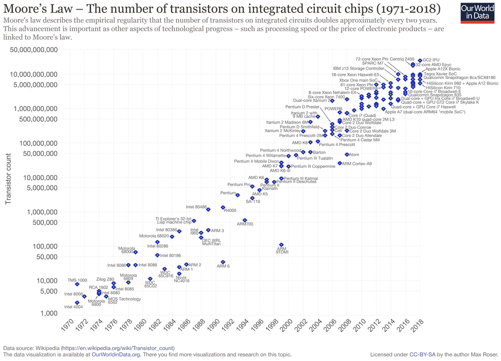

# Quantum Prime Numbers Generator
### NO,, IS NOT what you may think at first .. 
### however, here, the word **Quantum** is properly used .. 

this is about a **prime number generator** can actually be done by just using TTL logic .. :D

and ..

it's about, GENERATE ANY of them  
( not just fermat or alike and specially not, using any sieve technique )    
it will fire them out one by one .. just like generator actually means ..  

the only exception is  
not to be able to jump to a specific N occurrence of a prime  
because a bit more complicated while still feasible in theory ..   

### preface ..
To get you in a correct perspective and avoid you to fall,  
for the wrong assumption (as usual),  
which will make you believe I'm just a lunatic which don't know what is talking about ..  
let me point out something about me ..  

1) the very first computer I did ever use ( much too expensive to own )  
    was not even using a CPU,  instead it have had 2  TTL boards ( PUCE1 and PUCE2 )
    https://en.wikipedia.org/wiki/Olivetti_P6060
2) in 1991 when most CPU where still in 8/16 bit era,
   and parallel multiplier was still only present in specialized chips ( math coprocessors)
   I did design a very revolutionary new CPU .. 
   (Inspired by a CPU created few years early, 
   (ARM, the CPU that most likely (99.9999%) is in your mobile device right now))
   I did never published my work on this cause was much too early and then,
   the industry much too corrupt .. 
   my design would only get effectively relevant starting from 32 bits .. 
   and they were still counting each single transistor on the chip ..
   while today the transistors count goes in the order od BILIONS/TRILIONS per chip
      

